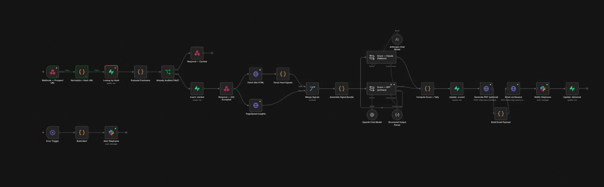

# SimplWorks Friction Audit Engine

**The front-end CTA for a web design agency, automated end to end.**

A prospect drops their website URL on your site. Seconds later they get a branded, scored 10-point audit of their own site in their inbox, and their name, email, and phone land in your Slack to follow up. Give away the audit, win the build.

Built in [n8n](https://n8n.io). This repo is the workflow plus the website integration, shared as free value for the AI Automation campus.



---

## What it does

1. A visitor submits the "Get a free audit" form on the agency site (name, email and/or phone, their website URL).
2. The site fires an **authenticated** webhook to the n8n engine.
3. The engine fetches and parses the prospect's site, runs **Google Lighthouse**, and scores it against a **10-point friction framework** organized in three layers of the buyer journey:
   - **FOUND** (points 1-3): can a prospect find this business at all? Search visibility, AI / answer-engine visibility, local and category presence.
   - **CLEAR** (points 4-7): once found, does the site explain the business and guide the visitor to act? Messaging clarity, CTA, customer-aligned copy, conversion-path integrity.
   - **CREDIBLE** (points 8-10): does it earn trust and feel like a real business? Trust signals, performance and technical health, ownership signals.
4. It renders a **branded PDF** with [Cloudflare Browser Rendering](https://developers.cloudflare.com/browser-rendering/) and emails it to the prospect from the agency's domain.
5. It posts a **lead alert** (name, email, phone, score) to Slack so the agency can follow up.

The free audit is the hook. The follow-up is the close.

**The funnel and the framework are built on The Real World's principles:** value-first conversion and the belief sequence the campus teaches. The free audit is the give-first hook, the report is framed around the prospect's own pain, and the build earns the close by what it demonstrates, not by what it claims.

---

## Why it is a system, not a toy

- **Async from byte one.** The webhook returns `202` instantly; the heavy work runs in the background. Nobody holds a connection open for 60 seconds.
- **Idempotent.** URLs are normalized + hashed and deduped, so the same site is never re-audited within 14 days.
- **Parallel by design.** The site fetch and the Lighthouse call fan out and run at the same time, then fan back in at a Merge.
- **Hybrid scoring.** Deterministic signals (title/meta/H1/schema, Lighthouse scores, link + ownership checks) handle what is *measurable*; an LLM scores the *judgment* points against the rubric and returns typed JSON via a Structured Output Parser. It measures what it can and reasons about the rest.
- **LLM resilience.** GPT runs primary with an **Anthropic fallback** wired to the error output. A model hiccup doesn't drop the audit.
- **Checkpoints.** State is written to the database at every stage: `started` → `scored` → `delivered`.
- **Dedicated error sub-flow.** Any node failure logs the exact step and pings Slack. No silent crash.
- **Authenticated webhook.** Header Auth (shared secret) so only the agency site can trigger the engine. No open endpoint to abuse.

---

## Stack

`n8n` · `Supabase` · `OpenAI (GPT-4.1-mini)` · `Anthropic (Claude)` · `Google PageSpeed / Lighthouse` · `Cloudflare Browser Rendering` · `Resend` · `Slack` · `Next.js` (the website route)

---

## Files

| Path | What it is |
|---|---|
| `n8n/friction-audit-engine.json` | The full n8n workflow. Import via **Workflows → Import from File**. |
| `website/friction-audit-route.js` | The Next.js API route that captures the lead, sends a notification, and fires the engine with the shared-secret header. |
| `assets/workflow.png` | The node graph. |
| `.env.example` | The environment variables both sides need. |

> Credential **values** are not in this repo, only references. You connect your own keys in n8n and your host's env.

---

## Setup (high level)

1. **Import** `n8n/friction-audit-engine.json` into n8n.
2. **Connect credentials** in n8n: Supabase (service role), OpenAI, Anthropic, Resend (Header Auth, `Authorization: Bearer ...`), Cloudflare Browser Rendering (Header Auth, `Authorization: Bearer <CF token>`), PageSpeed (Query Auth, `key`), Slack (bot token, `chat:write`).
3. **Create the Supabase table** (SQL below).
4. **Lock the webhook**: set the Webhook node to Header Auth with a shared secret, and give your site the matching secret.
5. **Wire the site**: drop `friction-audit-route.js` into your Next.js app, set the env vars, point the form at it.

### Supabase table

```sql
create table public.friction_audits (
  id uuid primary key default gen_random_uuid(),
  url text not null,
  url_hash text not null,
  host text,
  email text,
  status text not null default 'started',   -- started | scored | delivered | failed
  score int,
  pass_count int,
  partial_count int,
  fail_count int,
  results jsonb,
  pdf_url text,
  failed_stage text,
  created_at timestamptz not null default now(),
  updated_at timestamptz not null default now()
);
create index on public.friction_audits (url_hash);
alter table public.friction_audits enable row level security;
```

---

## Notes

Shared as free value for the AI Automation campus. Take it, build on it, make it yours.

The 10-point framework is SimplWorks' Friction Audit methodology. The architecture is here to learn from; the credentials, prompt tuning, and brand are mine.

Built by **SimplWorks** · web design + AI automation · [simplworks.ai](https://simplworks.ai)
